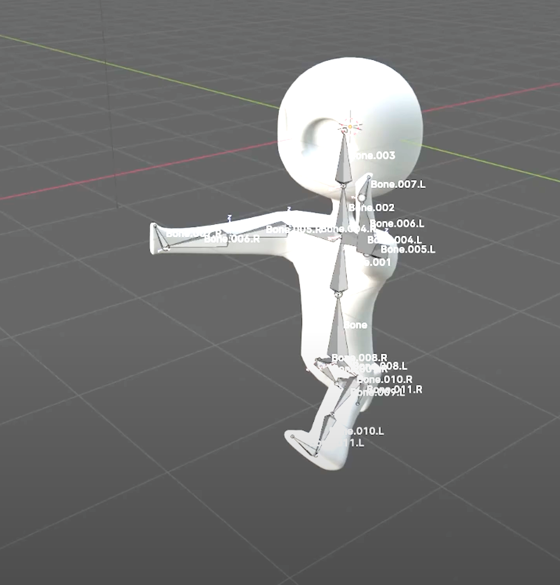

# Lightweaver - Light-Bending Puzzle Game Created For Acerola Jam 0 

--- 

 
   
   
   

--- 

This puzzle game explores the concept of "aberration" through light manipulation mechanics. Created during the 14-day Acerola Jam 0, Lightweaver challenges players to bend, split, and redirect light beams using mirrors, prisms, and black holes to solve increasingly complex puzzles. The game features chromatic aberration effects where white light splits into RGB components, requiring players to hit specific colored targets in the correct sequence across multiple themed environments.

Play The Game: https://thedevatlas.itch.io/lightweaverjam

Game Jam: https://itch.io/jam/acerola-jam-0

Watch the Development Video: https://www.youtube.com/watch?v=blfjQv55u9U&t=22s

Behind the elegant puzzle mechanics lies sophisticated Unity Line Renderer optimization and real-time light beam physics calculations. I used this project to push my game jam development skills and explore advanced rendering techniques while delivering polished gameplay within the intense 14-day deadline.
